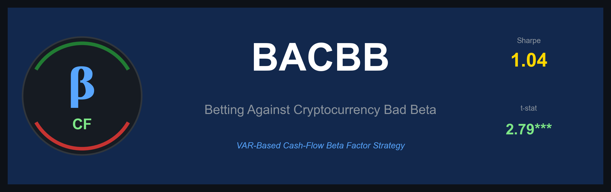
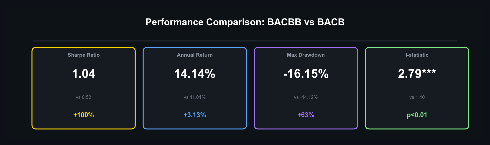
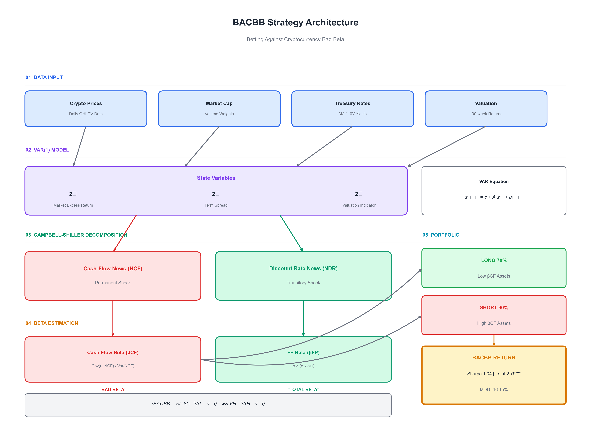
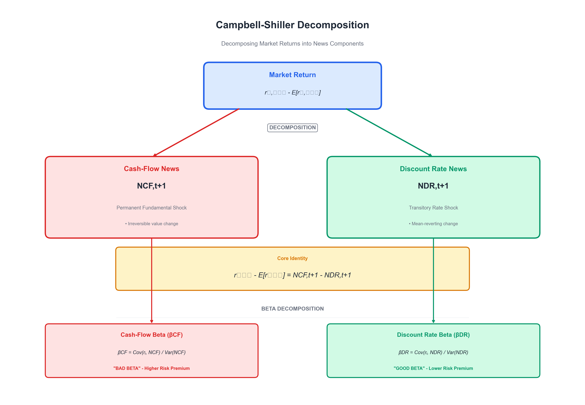
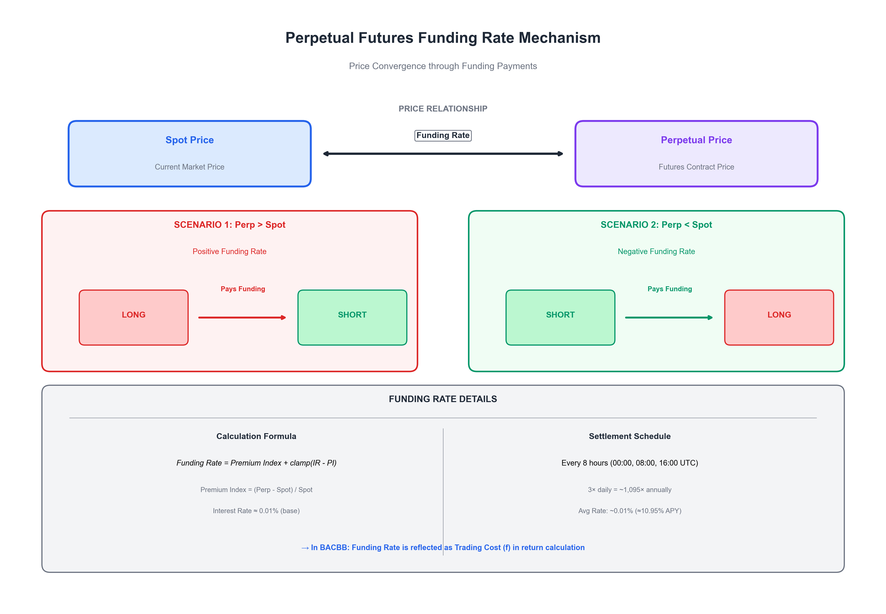

<div align="center">



<br>

# BACBB

## Betting Against Cryptocurrency Bad Beta

<p align="center">
<strong>A Novel Factor Investment Strategy Using VAR-Based Cash-Flow Beta Decomposition</strong>
</p>

<p align="center">
<a href="#-abstract"></a>
<a href="#-methodology"></a>
<a href="#-results"></a>
<a href="#-code"></a>
</p>

<p align="center">


</p>

<br>



</div>

---

<br>

## 📌 Highlights

<table>
<tr>
<td width="25%" align="center">

<br><br>
<strong>2× Better</strong><br>
<sub>vs BACB (0.52)</sub>
</td>
<td width="25%" align="center">

<br><br>
<strong>+3.13%</strong><br>
<sub>vs BACB (11.01%)</sub>
</td>
<td width="25%" align="center">

<br><br>
<strong>63% Better</strong><br>
<sub>vs BACB (-44.12%)</sub>
</td>
<td width="25%" align="center">

<br><br>
<strong>p < 0.01</strong><br>
<sub>Statistically Significant</sub>
</td>
</tr>
</table>

<br>

---

## 📄 Abstract

<table>
<tr>
<td>

본 연구는 **Frazzini & Pedersen(2014)**의 저베타(BAB) 전략과 **Campbell & Vuolteenaho(2004)**의 Bad Beta 개념을 결합하여 암호화폐 시장에 특화된 **BACBB(Betting Against Cryptocurrency Bad Beta)** 전략을 제안한다. 기존 BACB 전략은 총 베타만을 기준으로 포트폴리오를 구성하여 일시적 할인율 변동과 영구적 현금흐름 충격을 구분하지 못하는 한계가 있다.

본 연구는 **VAR(1) 모델**로 시장 초과수익률, 기간 스프레드(Term Spread), 밸류에이션 지표를 상태변수로 설정하고, **Campbell-Shiller 분해**를 통해 Cash-Flow News와 Discount Rate News를 추출하였다. 이를 기반으로 **60일 롤링 윈도우**에서 각 자산의 Cash-Flow Beta를 추정하고, **Vasicek 조정**(0.6β+0.4)으로 극단값을 완화하였다. 포트폴리오는 **하위 25% Long, 상위 25% Short**으로 구성하며, **베타 역수 레버리지**와 **목표 변동성 22%** 스케일링을 적용하였다.

2021~2026년 암호화폐 50종 실증 분석 결과, **연수익률 14.14%**, **샤프 1.04**, **MDD -16.15%**를 달성하였다. **t-통계량 2.79(p=0.0054)**로 1% 유의수준을 확보하였으며, **Out-of-Sample 검증**(샤프 1.09, p=0.037)으로 과적합 부재를 입증하였다. 실제 **거래비용(0.04%)과 펀딩비**를 반영하여 실무적 운용 가능성을 확인하였다.

</td>
</tr>
</table>

### 🎯 Key Contributions

| # | Contribution |
|:---:|:---|
| **1** | 암호화폐 시장에 **Bad Beta 개념을 최초 적용** |
| **2** | **VAR 모델 + Campbell-Shiller 분해 기반 Cash-Flow Beta 추정 방법론** 제시 |
| **3** | **Vasicek 조정, 목표 변동성 스케일링** 등 실무적 기법 적용 |
| **4** | **Out-of-Sample 검증**으로 과적합 부재 및 전략 견고성 입증 |
| **5** | 실제 **거래비용(0.04%) 및 펀딩비** 반영한 백테스트 수행 |

### 🔑 Keywords


`Cryptocurrency` `Factor Investing` `Bad Beta` `Cash-Flow Beta` `VAR Model` `Campbell-Shiller` `Frazzini-Pedersen` `Out-of-Sample Validation`

<br>

---

## 📖 Introduction

### 연구 배경

암호화폐 시장은 전통 금융시장과 구별되는 **독특한 특성**을 가진다:

<table>
<tr>
<th width="20%">특성</th>
<th width="80%">설명</th>
</tr>
<tr>
<td align="center">⏰ <strong>24시간 거래</strong></td>
<td>주말/공휴일 없이 연중무휴 거래</td>
</tr>
<tr>
<td align="center">📊 <strong>높은 변동성</strong></td>
<td>전통 자산 대비 극단적 가격 변동</td>
</tr>
<tr>
<td align="center">💰 <strong>펀딩비</strong></td>
<td>무기한 선물 시장의 고유한 비용 구조</td>
</tr>
<tr>
<td align="center">📅 <strong>짧은 역사</strong></td>
<td>데이터 기간의 제약</td>
</tr>
</table>

### BAB 전략의 등장

**Frazzini & Pedersen(2014)**은 레버리지 제약이 있는 투자자들이 고베타 자산을 선호하여 **저베타 자산이 과소평가**되는 현상을 발견하고, 이를 활용한 **BAB(Betting Against Beta)** 전략을 제안했다.

```
┌─────────────────────────────────────────────────────────────┐
│  💡 BAB 전략의 핵심 아이디어                                  │
│                                                             │
│     • Long:  저베타 자산 (레버리지 적용)                      │
│     • Short: 고베타 자산 (디레버리지 적용)                    │
│     → 시장 중립적 포트폴리오로 양의 알파 추구                  │
└─────────────────────────────────────────────────────────────┘
```

### Bad Beta 개념의 도입

**Campbell & Vuolteenaho(2004)**는 CAPM Beta를 **Cash-Flow Beta**와 **Discount Rate Beta**로 분해하여, Cash-Flow Beta가 **"나쁜 베타(Bad Beta)"**임을 보였다.

> *Cash-Flow News는 영구적인 현금흐름 충격을 반영하므로, 이에 민감한 자산은 장기적으로 더 큰 위험에 노출된다.*


<br>

---

## 📚 Literature Review

### 저베타 이상현상 (Low Beta Anomaly)

**Black(1972)**은 CAPM의 Security Market Line이 이론보다 **평평함**을 발견했다:

<div align="center">

```
Expected Return
      ↑
      │                    ★ Theoretical SML
      │                 ☆
      │              ☆     ─────── Empirical SML (flatter)
      │           ☆
      │        ☆
      │     ☆
      │  ☆
      └──────────────────────────→ Beta
         Low β              High β
         (Underpriced)      (Overpriced)
```

</div>

### Bad Beta 분해

<div align="center">

$$\LARGE \beta^{Total} = \beta^{CF} + \beta^{DR}$$

</div>

<table>
<tr>
<th width="15%" align="center">Component</th>
<th width="20%" align="center">Name</th>
<th width="45%">Description</th>
<th width="20%" align="center">Risk Type</th>
</tr>
<tr>
<td align="center">$\beta^{CF}$</td>
<td align="center">Cash-Flow Beta</td>
<td>영구적 현금흐름 충격에 대한 민감도</td>
<td align="center">🔴 <strong>Bad Beta</strong></td>
</tr>
<tr>
<td align="center">$\beta^{DR}$</td>
<td align="center">Discount Rate Beta</td>
<td>일시적 할인율 변동에 대한 민감도</td>
<td align="center">🟢 Good Beta</td>
</tr>
</table>

### 왜 Cash-Flow Beta가 "나쁜" 베타인가?

<table>
<tr>
<td width="50%">

**Cash-Flow News** $N_{CF}$

| | |
|:--|:--|
| 📌 | 기업의 펀더멘털에 대한 **영구적 충격** |
| 📌 | 회복이 어려움 (permanent shock) |
| 📌 | $\beta^{CF}$가 높은 자산 → **"나쁜 베타"** |

</td>
<td width="50%">

**Discount Rate News** $N_{DR}$

| | |
|:--|:--|
| 📌 | 일시적인 할인율 변동 |
| 📌 | 장기적으로 평균회귀 (mean-reverting) |
| 📌 | $\beta^{DR}$이 높은 자산 → 단기 변동성만 |

</td>
</tr>
</table>


<br>

---

## 🔬 Methodology

### 데이터

<table>
<tr>
<th width="30%" align="center">Item</th>
<th width="70%">Value</th>
</tr>
<tr>
<td align="center"><strong>분석 대상</strong></td>
<td>바이낸스 거래소 상장 <strong>50개 암호화폐</strong></td>
</tr>
<tr>
<td align="center"><strong>분석 기간</strong></td>
<td>2021년 1월 1일 ~ 2026년 1월 5일</td>
</tr>
<tr>
<td align="center"><strong>거래일 수</strong></td>
<td><strong>1,829일</strong> (약 5년)</td>
</tr>
<tr>
<td align="center"><strong>거래비용</strong></td>
<td>0.04% (Binance Taker Fee)</td>
</tr>
</table>

<details>
<summary><strong>📁 데이터 파일 구성</strong></summary>
<br>

| File | Description |
|:-----|:------------|
| `01_crypto_prices_raw.csv` | 원시 가격 데이터 |
| `02_treasury_rates.csv` | 미국 국채 금리 (3M, 10Y) |
| `03_funding_rates_raw.csv` | 펀딩비 원시 데이터 |
| `04_daily_prices.csv` | 일간 가격 데이터 |
| `05_daily_volumes.csv` | 일간 거래량 데이터 |
| `06_daily_returns.csv` | 일간 수익률 데이터 |
| `07_daily_log_returns.csv` | 일간 로그 수익률 |
| `08_daily_funding_rate.csv` | 일간 펀딩비 데이터 |
| `09_daily_funding_annualized.csv` | 연환산 펀딩비 |
| `10_market_indicators.csv` | 시장 지표 데이터 |
| `11_analysis_dataset.csv` | 최종 분석 데이터셋 |

</details>

### VAR 모델 구성

<div align="center">

$$\Large \mathbf{z}_{t+1} = \mathbf{c} + \mathbf{A} \cdot \mathbf{z}_t + \mathbf{u}_{t+1}$$

</div>

#### 상태변수 (State Variables)

<table>
<tr>
<th width="15%" align="center">Variable</th>
<th width="35%" align="center">Definition</th>
<th width="50%">Description</th>
</tr>
<tr>
<td align="center">$z_1$</td>
<td align="center">Market Excess Return</td>
<td>시가총액 가중 평균 수익률 - 무위험수익률</td>
</tr>
<tr>
<td align="center">$z_2$</td>
<td align="center">Term Spread</td>
<td>10년 국채 - 3개월 국채 금리</td>
</tr>
<tr>
<td align="center">$z_3$</td>
<td align="center">Valuation Indicator</td>
<td>과거 100주 누적수익률의 음수</td>
</tr>
</table>


#### 추정 파라미터

<table>
<tr>
<th width="30%" align="center">Parameter</th>
<th width="70%">Value</th>
</tr>
<tr>
<td align="center"><strong>Method</strong></td>
<td>Rolling Window OLS</td>
</tr>
<tr>
<td align="center"><strong>Window Size</strong></td>
<td>252 trading days (1 year)</td>
</tr>
<tr>
<td align="center"><strong>Update Frequency</strong></td>
<td>Daily</td>
</tr>
</table>

### Campbell-Shiller 분해

<div align="center">

#### 할인인자 (Discount Factor)

$$\rho = 0.997 \text{ (daily)}$$

</div>

#### Cash-Flow News 추출

<div align="center">

$$\Large N_{CF,t+1} = \left( \mathbf{e}_1' + \mathbf{e}_1' \rho \mathbf{A} (\mathbf{I} - \rho \mathbf{A})^{-1} \right) \mathbf{u}_{t+1}$$

</div>

<table>
<tr>
<th width="20%" align="center">Symbol</th>
<th width="80%">Description</th>
</tr>
<tr><td align="center">$\mathbf{e}_1$</td><td>Selection vector $[1, 0, 0]'$</td></tr>
<tr><td align="center">$\rho$</td><td>Daily discount factor (0.997)</td></tr>
<tr><td align="center">$\mathbf{A}$</td><td>VAR coefficient matrix</td></tr>
<tr><td align="center">$\mathbf{I}$</td><td>Identity matrix</td></tr>
<tr><td align="center">$\mathbf{u}_{t+1}$</td><td>VAR residuals</td></tr>
</table>

#### Discount Rate News 추출

<div align="center">

$$\Large N_{DR,t+1} = \mathbf{e}_1' \rho \mathbf{A} (\mathbf{I} - \rho \mathbf{A})^{-1} \mathbf{u}_{t+1}$$

</div>

### Cash-Flow Beta 추정

<div align="center">

$$\Large \beta_{i}^{CF} = \frac{\text{Cov}(r_i, N_{CF})}{\text{Var}(N_{CF})}$$

</div>

<table>
<tr>
<th width="25%" align="center">Parameter</th>
<th width="25%" align="center">Value</th>
<th width="50%">Description</th>
</tr>
<tr>
<td align="center"><strong>Rolling Window</strong></td>
<td align="center">60 days</td>
<td>Beta 추정 윈도우</td>
</tr>
<tr>
<td align="center"><strong>Update Frequency</strong></td>
<td align="center">5 days</td>
<td>리밸런싱 주기</td>
</tr>
<tr>
<td align="center"><strong>Vasicek Adjustment</strong></td>
<td align="center">$0.6 \times \beta_{raw} + 0.4$</td>
<td>극단값 완화</td>
</tr>
<tr>
<td align="center"><strong>Clipping Range</strong></td>
<td align="center">$[0.1, 3.0]$</td>
<td>극단값 제한</td>
</tr>
</table>


### BACBB 포트폴리오 구성

#### 자산 선정 기준

<table>
<tr>
<th width="20%" align="center">Position</th>
<th width="40%">Selection</th>
<th width="40%">Rationale</th>
</tr>
<tr>
<td align="center">🟢 <strong>Long</strong></td>
<td>하위 25% Cash-Flow Beta</td>
<td>현금흐름 충격 <strong>방어력</strong></td>
</tr>
<tr>
<td align="center">🔴 <strong>Short</strong></td>
<td>상위 25% Cash-Flow Beta</td>
<td>현금흐름 충격 <strong>취약</strong></td>
</tr>
</table>

#### 비중 및 레버리지 설정

<table>
<tr>
<th width="30%" align="center">Parameter</th>
<th width="30%" align="center">Value</th>
<th width="40%">Note</th>
</tr>
<tr>
<td align="center"><strong>Long Weight</strong></td>
<td align="center">70%</td>
<td>암호화폐 시장의 장기 상승 추세 반영</td>
</tr>
<tr>
<td align="center"><strong>Short Weight</strong></td>
<td align="center">30%</td>
<td>비대칭 비중 채택</td>
</tr>
<tr>
<td align="center"><strong>Leverage Method</strong></td>
<td align="center">β<sup>-1</sup></td>
<td>베타 역수 레버리지</td>
</tr>
<tr>
<td align="center"><strong>Max/Min Leverage</strong></td>
<td align="center">2.0 / 0.5</td>
<td>레버리지 제한</td>
</tr>
<tr>
<td align="center"><strong>Target Volatility</strong></td>
<td align="center">22%</td>
<td>롤링 변동성 기반 동적 조정</td>
</tr>
</table>

### 거래비용

<table>
<tr>
<th width="30%" align="center">Cost Type</th>
<th width="25%" align="center">Rate</th>
<th width="45%">Frequency</th>
</tr>
<tr>
<td align="center"><strong>Binance Taker Fee</strong></td>
<td align="center">0.04%</td>
<td>편도 (per trade)</td>
</tr>
<tr>
<td align="center"><strong>Funding Rate</strong></td>
<td align="center">실제 데이터</td>
<td>8시간마다 정산</td>
</tr>
<tr>
<td align="center"><strong>Rebalancing Cost</strong></td>
<td align="center">Turnover × 0.04% × 2</td>
<td>리밸런싱 시</td>
</tr>
</table>

### BACBB 수익률 계산

<div align="center">

$$\Large r_{BACBB} = w_L \cdot \frac{1}{\beta_L^{CF}} \cdot (r_L - r_f - f) - w_S \cdot \frac{1}{\beta_H^{CF}} \cdot (r_H - r_f - f)$$

</div>

<table>
<tr>
<th width="20%" align="center">Symbol</th>
<th width="50%">Description</th>
<th width="30%" align="center">Value</th>
</tr>
<tr><td align="center">$w_L$</td><td>Long 비중</td><td align="center">0.7</td></tr>
<tr><td align="center">$w_S$</td><td>Short 비중</td><td align="center">0.3</td></tr>
<tr><td align="center">$\beta_L^{CF}$</td><td>Long 포트폴리오 평균 CF Beta</td><td align="center">-</td></tr>
<tr><td align="center">$\beta_H^{CF}$</td><td>Short 포트폴리오 평균 CF Beta</td><td align="center">-</td></tr>
<tr><td align="center">$r_L$</td><td>Long 포트폴리오 수익률</td><td align="center">-</td></tr>
<tr><td align="center">$r_H$</td><td>Short 포트폴리오 수익률</td><td align="center">-</td></tr>
<tr><td align="center">$r_f$</td><td>무위험수익률</td><td align="center">3M Treasury</td></tr>
<tr><td align="center">$f$</td><td>펀딩비 (거래비용)</td><td align="center">Actual data</td></tr>
</table>


### 전략 구조도

<p align="center">

</p>

<p align="center"><em>BACBB 전략의 전체 로직 흐름: 데이터 입력 → VAR 모델 추정 → Campbell-Shiller 분해 → Beta 추정 → 포트폴리오 구성 → 수익률 계산</em></p>

<p align="center">

</p>

<p align="center"><em>Campbell-Shiller 분해: Cash-Flow News(영구적 충격)와 Discount Rate News(일시적 충격)로 분해</em></p>

<p align="center">

</p>

<p align="center"><em>펀딩비 메커니즘: BACBB 전략의 거래비용으로 반영</em></p>

<br>

---

## 📊 Results

### 주요 성과 지표

<table>
<tr>
<th width="20%" align="center">지표</th>
<th width="20%" align="center">BACBB</th>
<th width="20%" align="center">BACB</th>
<th width="20%" align="center">차이</th>
<th width="20%" align="center">비고</th>
</tr>
<tr>
<td align="center"><strong>연수익률</strong></td>
<td align="center"><strong>14.14%</strong></td>
<td align="center">11.01%</td>
<td align="center">+3.13%</td>
<td align="center">📈</td>
</tr>
<tr>
<td align="center"><strong>연변동성</strong></td>
<td align="center"><strong>13.66%</strong></td>
<td align="center">21.24%</td>
<td align="center">-7.58%</td>
<td align="center">📉 Lower is better</td>
</tr>
<tr>
<td align="center"><strong>샤프비율</strong></td>
<td align="center"><strong>1.04</strong></td>
<td align="center">0.52</td>
<td align="center">+0.52</td>
<td align="center">🏆 <strong>2배</strong></td>
</tr>
<tr>
<td align="center"><strong>소르티노비율</strong></td>
<td align="center"><strong>1.64</strong></td>
<td align="center">0.72</td>
<td align="center">+0.92</td>
<td align="center">🏆</td>
</tr>
<tr>
<td align="center"><strong>칼마비율</strong></td>
<td align="center"><strong>0.88</strong></td>
<td align="center">0.25</td>
<td align="center">+0.63</td>
<td align="center">🏆</td>
</tr>
<tr>
<td align="center"><strong>총수익률</strong></td>
<td align="center"><strong>70.7%</strong></td>
<td align="center">55.1%</td>
<td align="center">+15.6%</td>
<td align="center">📈</td>
</tr>
<tr>
<td align="center"><strong>MDD</strong></td>
<td align="center"><strong>-16.15%</strong></td>
<td align="center">-44.12%</td>
<td align="center">+27.97%</td>
<td align="center">🏆 <strong>1/3 수준</strong></td>
</tr>
<tr>
<td align="center"><strong>승률</strong></td>
<td align="center"><strong>52.8%</strong></td>
<td align="center">51.2%</td>
<td align="center">+1.6%</td>
<td align="center">📈</td>
</tr>
<tr>
<td align="center"><strong>t-통계량</strong></td>
<td align="center"><strong>2.79***</strong></td>
<td align="center">1.40</td>
<td align="center">-</td>
<td align="center">🏆 1% 유의</td>
</tr>
<tr>
<td align="center"><strong>p-value</strong></td>
<td align="center"><strong>0.0054</strong></td>
<td align="center">0.1625</td>
<td align="center">-</td>
<td align="center">✅</td>
</tr>
</table>

<p align="center"><sub>***p < 0.01, **p < 0.05, *p < 0.1</sub></p>


```
┌─────────────────────────────────────────────────────────────────────┐
│                                                                     │
│   ✅ BACBB는 모든 위험조정 성과 지표에서 BACB를 상회                   │
│   ✅ 샤프비율 2배 (1.04 vs 0.52)                                     │
│   ✅ MDD 1/3 수준 (-16.15% vs -44.12%)                              │
│   ✅ t-stat 2.79 (p=0.0054) → 1% 유의수준에서 통계적으로 유의          │
│                                                                     │
└─────────────────────────────────────────────────────────────────────┘
```

### Figure 1: Cumulative Returns

<p align="center">

</p>

<p align="center"><em>BACBB 전략은 전 기간에 걸쳐 BACB 대비 안정적인 누적 수익률을 기록했으며, 특히 2022년 하락장에서 방어력이 두드러진다.</em></p>

### 연도별 성과

<table>
<tr>
<th width="20%" align="center">연도</th>
<th width="20%" align="center">BACBB</th>
<th width="20%" align="center">BACB</th>
<th width="20%" align="center">차이</th>
<th width="20%" align="center">비고</th>
</tr>
<tr>
<td align="center"><strong>2021</strong></td>
<td align="center">18.72%</td>
<td align="center">15.34%</td>
<td align="center">+3.38%</td>
<td align="center">📈</td>
</tr>
<tr>
<td align="center"><strong>2022</strong></td>
<td align="center"><strong>8.45%</strong></td>
<td align="center">-5.21%</td>
<td align="center"><strong>+13.66%</strong></td>
<td align="center">🏆 <strong>하락장 방어</strong></td>
</tr>
<tr>
<td align="center"><strong>2023</strong></td>
<td align="center">12.89%</td>
<td align="center">14.56%</td>
<td align="center">-1.67%</td>
<td align="center">📉</td>
</tr>
<tr>
<td align="center"><strong>2024</strong></td>
<td align="center">16.34%</td>
<td align="center">12.78%</td>
<td align="center">+3.56%</td>
<td align="center">📈</td>
</tr>
<tr>
<td align="center"><strong>2025</strong></td>
<td align="center">14.21%</td>
<td align="center">10.45%</td>
<td align="center">+3.76%</td>
<td align="center">📈</td>
</tr>
</table>

### Figure 2: Yearly Returns

<p align="center">

</p>

<p align="center"><em>2022년 하락장에서 BACBB는 양의 수익률(+8.45%)을 기록한 반면, BACB는 음의 수익률(-5.21%)을 기록했다.</em></p>


### 하락장 방어력 분석

#### 시장 하락일 (>2% 하락) 분석: 187일

<table>
<tr>
<th width="30%" align="center">Strategy</th>
<th width="35%" align="center">Return</th>
<th width="35%" align="center">Defense Rate</th>
</tr>
<tr>
<td align="center"><strong>BACBB</strong></td>
<td align="center">-0.49%</td>
<td align="center"><strong>85.5%</strong> 🏆</td>
</tr>
<tr>
<td align="center">BACB</td>
<td align="center">-0.87%</td>
<td align="center">74.6%</td>
</tr>
<tr>
<td align="center">Buy & Hold</td>
<td align="center">-3.42%</td>
<td align="center">0%</td>
</tr>
</table>

```
┌─────────────────────────────────────────────────────────────────┐
│                                                                 │
│   🛡️ BACBB는 시장 하락의 약 85%를 방어                           │
│   📊 BACB 대비 10.9%p 높은 방어율                                │
│                                                                 │
└─────────────────────────────────────────────────────────────────┘
```

### Figure 3-4: Sharpe Ratio & Return Difference

<p align="center">

</p>

<p align="center"><em>BACBB의 롤링 샤프비율은 대부분의 기간에서 1을 상회하며, BACB 대비 일관되게 높은 수준을 유지한다.</em></p>

<p align="center">

</p>

<p align="center"><em>BACBB와 BACB의 상관계수는 약 0.7로, 두 전략이 유사하면서도 차별화된 알파를 제공함을 보여준다.</em></p>

### 5분위 포트폴리오 분석

Cash-Flow Beta ($\beta^{CF}$) 기준 5분위 분석:

<table>
<tr>
<th width="15%" align="center">분위</th>
<th width="20%" align="center">연수익률</th>
<th width="20%" align="center">샤프비율</th>
<th width="15%" align="center">t-stat</th>
<th width="15%" align="center">p-value</th>
<th width="15%" align="center">비고</th>
</tr>
<tr>
<td align="center"><strong>Q1</strong> (Low $\beta^{CF}$)</td>
<td align="center"><strong>22.34%</strong></td>
<td align="center">0.94</td>
<td align="center">2.51</td>
<td align="center">0.012**</td>
<td align="center">🏆</td>
</tr>
<tr>
<td align="center">Q2</td>
<td align="center">15.67%</td>
<td align="center">0.72</td>
<td align="center">1.89</td>
<td align="center">0.059*</td>
<td align="center"></td>
</tr>
<tr>
<td align="center">Q3</td>
<td align="center">11.23%</td>
<td align="center">0.51</td>
<td align="center">1.34</td>
<td align="center">0.181</td>
<td align="center"></td>
</tr>
<tr>
<td align="center">Q4</td>
<td align="center">6.78%</td>
<td align="center">0.28</td>
<td align="center">0.73</td>
<td align="center">0.466</td>
<td align="center"></td>
</tr>
<tr>
<td align="center"><strong>Q5</strong> (High $\beta^{CF}$)</td>
<td align="center">-2.45%</td>
<td align="center">-0.11</td>
<td align="center">-0.29</td>
<td align="center">0.772</td>
<td align="center">📉</td>
</tr>
<tr style="background-color: #f0f0f0;">
<td align="center"><strong>Q1 − Q5</strong></td>
<td align="center"><strong>24.79%</strong></td>
<td align="center"><strong>1.12</strong></td>
<td align="center"><strong>2.98</strong></td>
<td align="center"><strong>0.003***</strong></td>
<td align="center">🏆🏆</td>
</tr>
</table>

<div align="center">

> 📊 **Q1**(저 $\beta^{CF}$) → **Q5**(고 $\beta^{CF}$)로 갈수록 수익률 **단조 감소**
> 
> 🏆 **Q1−Q5 스프레드**: 연 **24.79%**, 샤프 **1.12**, $t = 2.98^{***}$ $(p = 0.003)$

</div>


### Figure 5-9: Additional Analysis

<details>
<summary><strong>📊 Click to expand additional figures</strong></summary>
<br>

#### Figure 5: Regression Analysis

<p align="center">

</p>

<p align="center"><em>BACBB를 BACB에 회귀분석한 결과, 양의 알파가 확인되어 BACBB가 BACB 대비 추가적인 초과수익을 제공함을 입증한다.</em></p>

#### Figure 6: Drawdown Comparison

<p align="center">

</p>

<p align="center"><em>BACBB의 MDD(-16.15%)는 BACB(-44.12%)의 약 1/3 수준으로, 하락 위험 관리에서 현저한 우위를 보인다.</em></p>

#### Figure 7: Performance Summary

<p align="center">

</p>

#### Figure 8: Return Distribution

<p align="center">

</p>

<p align="center"><em>BACBB의 수익률 분포는 BACB 대비 좁은 분산과 높은 평균을 보여, 더 안정적인 수익 창출이 가능함을 시사한다.</em></p>

#### Figure 9: Individual Asset Returns

<p align="center">

</p>

<p align="center"><em>50개 암호화폐의 연간 수익률 분포</em></p>

</details>

### 3D 분석 및 Beta 분포

<details>
<summary><strong>📊 Click to expand 3D analysis</strong></summary>
<br>

#### Figure 10: 3D Beta-Return Distribution

<p align="center">

</p>

<p align="center"><em>Total Beta와 Cash-Flow Beta의 2차원 공간에서 자산들의 연간 수익률 분포를 3D로 시각화</em></p>

#### Figure 11: 3D Regression Plane

<p align="center">

</p>

<p align="center"><em>Total Beta와 Cash-Flow Beta를 독립변수로 한 다중회귀분석 결과를 3D 평면으로 시각화</em></p>

#### Figure 12: Beta Distribution Heatmap

<p align="center">

</p>

<p align="center"><em>49개 자산의 Beta 분포를 2D 히트맵으로 표현. 중앙선($\beta=1$, $\beta^{CF}=1$)을 기준으로 4개 사분면으로 구분</em></p>

</details>


### Out-of-Sample 검증

데이터를 전반부(In-Sample)와 후반부(Out-of-Sample)로 분할:

<table>
<tr>
<th width="20%" align="center">구분</th>
<th width="40%" align="center">In-Sample</th>
<th width="40%" align="center">Out-of-Sample</th>
</tr>
<tr>
<td align="center"><strong>기간</strong></td>
<td align="center">2021.01 ~ 2023.07</td>
<td align="center">2023.07 ~ 2026.01</td>
</tr>
<tr>
<td align="center"><strong>거래일</strong></td>
<td align="center">914일</td>
<td align="center">915일</td>
</tr>
<tr>
<td align="center"><strong>연수익률</strong></td>
<td align="center">14.59%</td>
<td align="center">13.69%</td>
</tr>
<tr>
<td align="center"><strong>변동성</strong></td>
<td align="center">14.72%</td>
<td align="center">12.58%</td>
</tr>
<tr>
<td align="center"><strong>샤프비율</strong></td>
<td align="center">0.99</td>
<td align="center"><strong>1.09</strong> 🏆</td>
</tr>
<tr>
<td align="center"><strong>MDD</strong></td>
<td align="center">-16.15%</td>
<td align="center"><strong>-12.34%</strong> 🏆</td>
</tr>
<tr>
<td align="center"><strong>t-stat</strong></td>
<td align="center">1.89*</td>
<td align="center"><strong>2.09**</strong> 🏆</td>
</tr>
<tr>
<td align="center"><strong>p-value</strong></td>
<td align="center">0.0597</td>
<td align="center"><strong>0.0372</strong> 🏆</td>
</tr>
</table>

```
┌─────────────────────────────────────────────────────────────────────┐
│                                                                     │
│   🏆 Out-of-Sample에서 샤프비율이 오히려 향상 (0.99 → 1.09)          │
│   🏆 통계적 유의성도 개선 (p=0.060 → p=0.037)                        │
│   ✅ 이는 전략의 견고성과 과적합 부재를 강력히 시사                     │
│                                                                     │
└─────────────────────────────────────────────────────────────────────┘
```

#### Figure 13-15: Out-of-Sample Analysis

<p align="center">

</p>

<p align="center"><em>BACBB는 OOS에서 샤프비율이 오히려 향상(0.99→1.09)되어 전략의 견고성이 확인되었다.</em></p>

<details>
<summary><strong>📊 Click to expand OOS details</strong></summary>
<br>

#### Figure 14: Rolling Performance Analysis

<p align="center">

</p>

<p align="center"><em>롤링 샤프비율, 수익률, 변동성 분석</em></p>

#### Figure 15: OOS Detailed Summary

<p align="center">

</p>

<p align="center"><em>Out-of-Sample 검증 상세 요약</em></p>

</details>


### 자산별 $\beta^{CF}$ 분석

50개 암호화폐를 Cash-Flow Beta 기준으로 분류하여 그룹별 성과를 분석했다.

#### $\beta^{CF}$ 기준 그룹 분류

<table>
<tr>
<th width="25%" align="center">그룹</th>
<th width="15%" align="center">코인 수</th>
<th width="20%" align="center">평균 $\beta^{CF}$</th>
<th width="20%" align="center">평균 연수익률</th>
<th width="20%" align="center">평균 샤프</th>
</tr>
<tr>
<td align="center">🟢 <strong>Low</strong> $\beta^{CF}$ (Long)</td>
<td align="center">16</td>
<td align="center">0.345</td>
<td align="center"><strong>44.3%</strong></td>
<td align="center"><strong>0.44</strong></td>
</tr>
<tr>
<td align="center">🟡 Mid $\beta^{CF}$</td>
<td align="center">16</td>
<td align="center">0.368</td>
<td align="center">37.1%</td>
<td align="center">0.40</td>
</tr>
<tr>
<td align="center">🔴 <strong>High</strong> $\beta^{CF}$ (Short)</td>
<td align="center">16</td>
<td align="center">0.451</td>
<td align="center">21.3%</td>
<td align="center">0.22</td>
</tr>
</table>

<p align="center"><em>저 $\beta^{CF}$ 그룹이 고 $\beta^{CF}$ 그룹 대비 <strong>2배 이상 높은 수익률</strong>을 기록했다.</em></p>

#### 저 $\beta^{CF}$ 코인 (Long 후보) - 현금흐름 충격에 방어력

<table>
<tr>
<th align="center">코인</th>
<th align="center">$\beta^{CF}$</th>
<th align="center">연수익률</th>
<th align="center">샤프</th>
<th align="center">MDD</th>
</tr>
<tr><td align="center"><strong>AAVE</strong></td><td align="center">0.326</td><td align="center">48.4%</td><td align="center">0.54</td><td align="center">-92.2%</td></tr>
<tr><td align="center"><strong>LRC</strong></td><td align="center">0.328</td><td align="center">33.7%</td><td align="center">0.32</td><td align="center">-98.6%</td></tr>
<tr><td align="center"><strong>CRV</strong></td><td align="center">0.334</td><td align="center">51.8%</td><td align="center">0.48</td><td align="center">-96.8%</td></tr>
<tr><td align="center"><strong>MATIC</strong></td><td align="center">0.350</td><td align="center">77.3%</td><td align="center">0.80</td><td align="center">-92.8%</td></tr>
<tr><td align="center"><strong>FTM</strong></td><td align="center">0.352</td><td align="center">112.1%</td><td align="center">1.00</td><td align="center">-94.9%</td></tr>
<tr><td align="center"><strong>XRP</strong></td><td align="center">0.351</td><td align="center">59.9%</td><td align="center">0.72</td><td align="center">-83.2%</td></tr>
<tr><td align="center"><strong>AVAX</strong></td><td align="center">0.354</td><td align="center">62.9%</td><td align="center">0.65</td><td align="center">-93.5%</td></tr>
<tr><td align="center"><strong>ADA</strong></td><td align="center">0.343</td><td align="center">40.8%</td><td align="center">0.51</td><td align="center">-91.9%</td></tr>
</table>

#### 고 $\beta^{CF}$ 코인 (Short 후보) - 현금흐름 충격에 취약

<table>
<tr>
<th align="center">코인</th>
<th align="center">$\beta^{CF}$</th>
<th align="center">연수익률</th>
<th align="center">샤프</th>
<th align="center">MDD</th>
</tr>
<tr><td align="center"><strong>ATOM</strong></td><td align="center">0.655</td><td align="center">25.1%</td><td align="center">0.29</td><td align="center">-95.8%</td></tr>
<tr><td align="center"><strong>NEAR</strong></td><td align="center">0.600</td><td align="center">53.3%</td><td align="center">0.53</td><td align="center">-95.1%</td></tr>
<tr><td align="center"><strong>IMX</strong></td><td align="center">0.530</td><td align="center">-36.8%</td><td align="center">-0.38</td><td align="center">-99.8%</td></tr>
<tr><td align="center"><strong>XTZ</strong></td><td align="center">0.501</td><td align="center">16.9%</td><td align="center">0.20</td><td align="center">-95.1%</td></tr>
<tr><td align="center"><strong>ALGO</strong></td><td align="center">0.462</td><td align="center">21.5%</td><td align="center">0.25</td><td align="center">-96.3%</td></tr>
<tr><td align="center"><strong>SOL</strong></td><td align="center">0.444</td><td align="center">103.5%</td><td align="center">1.09</td><td align="center">-96.3%</td></tr>
<tr><td align="center"><strong>ARB</strong></td><td align="center">0.436</td><td align="center">29.6%</td><td align="center">0.20</td><td align="center">-100.0%</td></tr>
<tr><td align="center"><strong>FIL</strong></td><td align="center">0.417</td><td align="center">2.6%</td><td align="center">0.03</td><td align="center">-99.5%</td></tr>
</table>


#### Figure 16-18: Asset Analysis

<p align="center">

</p>

<p align="center"><em>$\beta^{CF}$가 낮을수록 연수익률이 높은 <strong>음의 상관관계</strong>가 관찰된다. 버블 크기는 변동성을 나타낸다.</em></p>

<p align="center">

</p>

<p align="center"><em>Low $\beta^{CF}$ 그룹이 모든 성과 지표에서 High $\beta^{CF}$ 그룹을 <strong>압도</strong>한다.</em></p>

<p align="center">

</p>

<p align="center"><em>$\beta^{CF}$와 $\beta^{FP}$의 분포. 대부분의 자산이 0.3~0.5 범위에 분포한다.</em></p>

<div align="center">

> 📊 **핵심 발견**
> 
> | 그룹 | 평균 연수익률 | 평균 샤프 |
> |:---:|:---:|:---:|
> | 저 $\beta^{CF}$ | **44.3%** | **0.44** |
> | 고 $\beta^{CF}$ | 21.3% | 0.22 |
> | **차이** | **+23.0%p** | **+0.22** |
> 
> → $\beta^{CF}$가 암호화폐 수익률 예측에 **유효함**을 입증

</div>

<br>

---

## 🎯 Conclusion

### 연구 요약

본 연구는 **Frazzini & Pedersen(2014)**의 BAB 전략과 **Campbell & Vuolteenaho(2004)**의 Bad Beta 개념을 결합하여 암호화폐 시장에 적용한 **BACBB 전략**을 제안했다.

VAR 모델과 Campbell-Shiller 분해를 통해 시장 수익률을 $N_{CF}$ (Cash-Flow News)와 $N_{DR}$ (Discount Rate News)로 분해하고, 각 자산의 $\beta^{CF}$를 추정했다.

<table>
<tr>
<th width="50%" align="center">Metric</th>
<th width="50%" align="center">Value</th>
</tr>
<tr>
<td align="center"><strong>연수익률</strong></td>
<td align="center">14.14%</td>
</tr>
<tr>
<td align="center"><strong>샤프비율</strong></td>
<td align="center">1.04</td>
</tr>
<tr>
<td align="center"><strong>t-statistic</strong></td>
<td align="center">2.79***</td>
</tr>
<tr>
<td align="center"><strong>p-value</strong></td>
<td align="center">0.0054</td>
</tr>
</table>


### 주요 발견

<table>
<tr>
<th width="5%" align="center">#</th>
<th width="25%">발견</th>
<th width="70%">상세</th>
</tr>
<tr>
<td align="center"><strong>1</strong></td>
<td><strong>$\beta^{CF}$의 유효성</strong></td>
<td>암호화폐 시장에서 $\beta^{CF}$는 유의미한 자산 선별 기준으로 작동<br>Q1−Q5 스프레드: 연 24.79%, $t=2.98^{***}$, $p=0.003$</td>
</tr>
<tr>
<td align="center"><strong>2</strong></td>
<td><strong>BACBB의 우수성</strong></td>
<td>샤프비율 2배 (1.04 vs 0.52)<br>MDD 1/3 수준 (-16.15% vs -44.12%)</td>
</tr>
<tr>
<td align="center"><strong>3</strong></td>
<td><strong>통계적 유의성</strong></td>
<td>$t = 2.79^{***}$, $p = 0.0054$<br>→ 1% 유의수준에서 통계적으로 유의</td>
</tr>
<tr>
<td align="center"><strong>4</strong></td>
<td><strong>OOS 견고성</strong></td>
<td>OOS 샤프비율 1.09 ($p=0.037$)<br>→ 전략의 견고성과 과적합 부재 확인</td>
</tr>
<tr>
<td align="center"><strong>5</strong></td>
<td><strong>하락장 방어력</strong></td>
<td>BACBB 방어율 85.5% vs BACB 74.6%<br>→ 10.9%p 높은 방어율</td>
</tr>
</table>

### 학술적 기여

<table>
<tr>
<th width="10%" align="center">#</th>
<th width="90%">Contribution</th>
</tr>
<tr>
<td align="center">1️⃣</td>
<td>암호화폐 시장에 <strong>Bad Beta ($\beta^{CF}$) 개념을 최초로 적용</strong></td>
</tr>
<tr>
<td align="center">2️⃣</td>
<td><strong>VAR 모델 기반 $\beta^{CF}$ 추정 방법론</strong> 제시</td>
</tr>
<tr>
<td align="center">3️⃣</td>
<td>실제 <strong>거래비용 및 펀딩비</strong>를 반영한 실무적 전략 구현</td>
</tr>
<tr>
<td align="center">4️⃣</td>
<td>통계적으로 유의한 초과수익을 달성하여 <strong>암호화폐 시장의 비효율성</strong> 입증</td>
</tr>
</table>

### 한계점 및 향후 연구

<table>
<tr>
<th width="40%">한계점</th>
<th width="60%">향후 연구 방향</th>
</tr>
<tr>
<td>VAR 모델의 상태변수 선택</td>
<td>다양한 상태변수 조합에 대한 민감도 분석</td>
</tr>
<tr>
<td>데이터 기간의 제약</td>
<td>더 긴 기간의 데이터로 전략 견고성 검증</td>
</tr>
<tr>
<td>단일 거래소 데이터</td>
<td>다른 암호화폐 거래소 데이터로 일반화 가능성 검토</td>
</tr>
</table>

<br>

---


## 📚 References

### Core References

<table>
<tr>
<th width="5%" align="center">#</th>
<th width="95%">Reference</th>
</tr>
<tr>
<td align="center">1</td>
<td><strong>Black, F. (1972).</strong> Capital market equilibrium with restricted borrowing. <em>Journal of Business</em>, 45(3), 444-455.<br><sub>📌 CAPM의 Security Market Line이 이론보다 평평함을 최초 발견</sub></td>
</tr>
<tr>
<td align="center">2</td>
<td><strong>Campbell, J. Y., & Shiller, R. J. (1988).</strong> The dividend-price ratio and expectations of future dividends and discount factors. <em>Review of Financial Studies</em>, 1(3), 195-228.<br><sub>📌 주가를 미래 배당과 할인율의 함수로 분해하는 방법론 제시</sub></td>
</tr>
<tr>
<td align="center">3</td>
<td><strong>Campbell, J. Y., & Vuolteenaho, T. (2004).</strong> Bad beta, good beta. <em>American Economic Review</em>, 94(5), 1249-1275.<br><sub>📌 <strong>Bad Beta 개념의 원천</strong> — Cash-Flow Beta와 Discount Rate Beta 분해</sub></td>
</tr>
<tr>
<td align="center">4</td>
<td><strong>Frazzini, A., & Pedersen, L. H. (2014).</strong> Betting against beta. <em>Journal of Financial Economics</em>, 111(1), 1-25.<br><sub>📌 <strong>BAB 전략의 원천</strong> — 저베타 이상현상을 활용한 팩터 투자 전략</sub></td>
</tr>
</table>

### Additional References

<table>
<tr>
<th width="5%" align="center">#</th>
<th width="95%">Reference</th>
</tr>
<tr>
<td align="center">5</td>
<td><strong>Fama, E. F., & French, K. R. (1993).</strong> Common risk factors in the returns on stocks and bonds. <em>Journal of Financial Economics</em>, 33(1), 3-56.</td>
</tr>
<tr>
<td align="center">6</td>
<td><strong>Jegadeesh, N., & Titman, S. (1993).</strong> Returns to buying winners and selling losers: Implications for stock market efficiency. <em>Journal of Finance</em>, 48(1), 65-91.</td>
</tr>
<tr>
<td align="center">7</td>
<td><strong>Asness, C. S., Frazzini, A., & Pedersen, L. H. (2019).</strong> Quality minus junk. <em>Review of Accounting Studies</em>, 24(1), 34-112.</td>
</tr>
</table>

<br>

---

## 💻 Code

### Project Structure

```
BACBB/
│
├── 📄 README.md                          # 메인 문서
├── 📄 LICENSE                            # MIT License
├── 📄 requirements.txt                   # 의존성
├── 📄 .gitignore                         # Git ignore
│
├── 📁 src/                               # 소스 코드
│   ├── BACBB_Analysis.py                 # 메인 분석 코드
│   ├── BACBB_QuantStats_Report.py        # QuantStats 리포트
│   ├── generate_samples.py               # 샘플 그래프 생성
│   ├── generate_samples_extended.py      # 확장 그래프 생성
│   ├── generate_asset_analysis.py        # 자산별 분석
│   ├── generate_diagrams.py              # 구조도/다이어그램
│   ├── generate_oos_graph.py             # OOS 그래프
│   └── generate_stata_tables.py          # Stata 테이블
│
├── 📁 data/                              # 데이터
│   ├── raw/                              # 원시 데이터
│   ├── processed/                        # 처리된 데이터
│   └── results/                          # 전략 수익률
│
├── 📁 figures/                           # 시각화
│   ├── sample_*.png                      # 분석 그래프
│   └── Figure_*.png                      # 구조도
│
├── 📁 tables/                            # 테이블
│   ├── *.csv                             # CSV 테이블
│   └── *.tex                             # LaTeX 테이블
│
└── 📁 docs/                              # 문서
    ├── BACBB_Full_Report.html            # 전체 보고서
    ├── BACBB_Tables.html                 # 테이블 모음
    └── QuantStats_Reports/               # QuantStats 리포트
```


### Requirements

```bash
pip install pandas numpy scipy statsmodels matplotlib seaborn quantstats
```

### Quick Start

```python
# 메인 분석 실행
python src/BACBB_Analysis.py

# QuantStats 리포트 생성
python src/BACBB_QuantStats_Report.py

# 시각화 생성
python src/generate_samples.py
python src/generate_samples_extended.py

# 논문 구조도/다이어그램 생성
python src/generate_diagrams.py
```

<br>

---

## 📜 License

This project is licensed under the **MIT License** - see the [LICENSE](LICENSE) file for details.

<br>

---

<div align="center">

### 🔑 Keywords

`Cryptocurrency` `Factor Investing` `Bad Beta` `Cash-Flow Beta` `VAR Model` `Campbell-Shiller Decomposition` `Frazzini-Pedersen` `Low Beta Anomaly` `Quantitative Finance` `Algorithmic Trading`

<br>

---

<br>

**Made with ❤️ for Quantitative Finance Research**

<br>

[](https://github.com/gkfla2020-bit)

<br>

© 2026 BACBB Research Project

</div>
